# Rhoynar-DevOps-Automation

## Physical Machines - Prerequisite

Five Machines, 1 puppet-master and 4 puppet-agent is required.

|Node|Name|Requirements|Purpose|
|:---:|:---:|:---|:---:|
|1|Master|OS: Debian Jessie<br>RAM: 2GB+|puppet-master|
|2|Agent1|OS: Debian Jessie<br>**RAM: 8GB+**|Jira|
|3|Agent2|OS: Debian Jessie<br>RAM: 2GB+|Jenkins|
|4|Agent3|OS: Debian Jessie<br>RAM: 2GB+|Gerrit|
|5|Agent4|OS: Debian Jessie<br>RAM: 2GB+|Zuul|

---

### Vagrant with puppet node provisioning using shell script

*Tested with Linux (Debian Jessie)*

**Note: We can use vagrant setup procedure for Testing Purpose, it is not required if installation is for Physical machines.**

##### Prerequisite:

> [Vagrant](https://www.vagrantup.com/downloads.html) >= 1.8.5

Download URL's:
- For [Mac](http://download.virtualbox.org/virtualbox/5.1.2/VirtualBox-5.1.2-108956-OSX.dmg)
- For [windows](http://download.virtualbox.org/virtualbox/5.1.2/VirtualBox-5.1.2-108956-Win.exe)

> [Virual Box](https://www.virtualbox.org/wiki/Downloads) >= 5.1.2

Download URL's:
- For [Mac](https://releases.hashicorp.com/vagrant/1.8.5/vagrant_1.8.5.dmg)
- For [windows](https://releases.hashicorp.com/vagrant/1.8.5/vagrant_1.8.5.msi)

### Provision Vagrant Machines

Here we are provisioning **five** virtual machines into virtual box using vagrant, follow the below instructions to provisioning.
* Chnage directory where *Vagrantfile* is placed.
* Ensure that both [*puppet-master.sh*][master] and [*puppet-agent.sh*][agent] is present in same location where vagrant file is placed.

Make the below  necessary changes in Vagranfile (if required e.g if you want to change ip addresses for nodes)

##### 1. For Master VM:

```
config.vm.define "master" do |master|
master.vm.network "private_network", ip: "192.168.35.11"
master.vm.provision "shell", path: "puppet-master.sh", args: "-m 'master' -H '192.168.35.11' -a 'agent' -h '192.168.35.12 192.168.35.13 192.168.35.14 192.168.35.15'"
```

**Description:**
- -m : master host name.
- -h : master host IP.
- -a : agent nodes (Required for autosign certificate)

##### 2. For Agent VM

```
config.vm.define "agent1" do |agent1|
agent1.vm.network "private_network", ip: "192.168.35.12"
agent1.vm.provision "shell", path: "puppet-agent.sh", args: "-m 'master' -H '192.168.35.11' -a 'agent' -h '192.168.35.12 192.168.35.13 192.168.35.14 192.168.35.15' -i 'agent1'"
end
```

Repeat the same steps in other agents by replacing the agent name.

### Scripts

- [puppet-master.sh][master] : for puppet master installation and configuration while provisioning VM.
- [puppet-agent.sh][agent]   : for puppet agent installation and configuration while provisioning.

[master]: https://raw.githubusercontent.com/sagarinitcron/rhoynar-devops-automation/master/rhoynar-provision-puppetsetup/puppet-master.sh
[agent]: https://raw.githubusercontent.com/sagarinitcron/rhoynar-devops-automation/master/rhoynar-provision-puppetsetup/agent-new.sh

### How to run:

Use below command for provision VMs in single shot  with vagrant (first time it will take time because it will need to download the linux box).

```
	vagrant up
```

Once it is finished successfully, check the status using below command

```
	vagrant global-status
```

Now we can login the VM, using below command

```
	vagrant ssh master
```

we can provide VM id otherwise VM name while login to instance


### Now we will turn to puppet

In puppet we need to make main `site.pp` into "/etc/puppet/manifiest/site.pp", which will consider module distribution to agent, look into below code for sample. Visit this [link](https://raw.githubusercontent.com/sagarinitcron/rhoynar-devops-automation/master/manifests/site.pp) to check the complete code.

```

node 'agent1.example.com'{
include gerrit

class { 'jenkins::slave':
   		 masterurl => 'http://agent3.example.com:8080',
   		 ui_user => 'adminuser',
   		 ui_pass => 'adminpass',
		}
}

node 'agent2.example.com'{
	include jenkins
	include jenkins::master
}
```
---

### Steps for physical machine based installation

> Step 1

Setting up static ip for stable puppet master-agent configuration.

* The majority of network setup can be done via the *interfaces* configuration file at `/etc/network/interfaces`.

* Configuring the interface manually by adding something like this to `/etc/network/interfaces` will set the default ip (network, broadcast and gateway are optional):

  ```
  auto eth0
  iface eth0 inet static
  address 192.168.35.11
  netmask 255.255.255.0
  gateway 192.168.35.1
  ```

**Note: Your IP configuration may vary according to your Internet settings**

* Configure sequentially IP's for Master(192.168.35.11) and Agent(192.168.35.12, 192.168.35.13, 192.168.35.14 & 192.168.35.15) machines respectively.

> Step 2

Login to Master Machine and configure puppet-master as follows,

* create executable file named *puppet-master.sh* and add the content form [here][master]

* Now run the following command to configure `puppet-master`.

```
./puppet-master.sh -m 'master' -H '192.168.35.11' -a 'agent' -h '192.168.35.12 192.168.35.13 192.168.35.14 192.168.35.15'
```

* Puppet-Master is configured successfully.

> Step 3

Login to each of the Agent Machine and configure puppet-agent as follows,

* create executable file named *puppet-agent.sh* and add the content form [here][agent]

* Now run the following command to configure `puppet-agent`.

```
./puppet-agent.sh -m 'master' -H '192.168.35.11' -a 'agent' -h '192.168.35.12 192.168.35.13 192.168.35.14 192.168.35.15' -i 'agent1'
```

**Note: Replace `-i` option at the end of command with respect to the agent's**

* Puppet-Agent is configured successfully in all agent's.

---

### Overview

Let us have an overview of our instances/Machines,

|Instance|Name|Purpose|Private IP's|
|:---:|:---:|:---:|:---:|
|1|Master|Puppet Master will be Installed|192.168.35.11|
|2|Agent1|Jira|192.168.35.12|
|3|Agent2|Jenkins|192.168.35.13|
|4|Agent3|Gerrit|192.168.35.14|
|5|Agent4|Zuul|192.168.35.15|

---

# MODULES

Let us explore each modules for detailed understanding,

## JIRA

As per our puppet module JIRA will be installed on *Agent1*

* Once puppet agent installs JIRA vist the url on port 8080 [*192.168.35.12:8080*](https://192.168.35.12:8080)

Setup JIRA by using the simple GUI as follows

* Choose Application name and Mode

  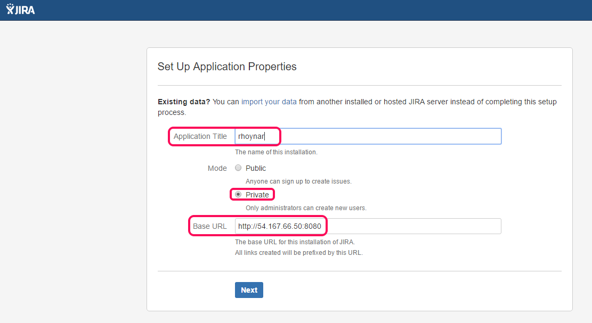

* Choose how do you want to use JIRA

  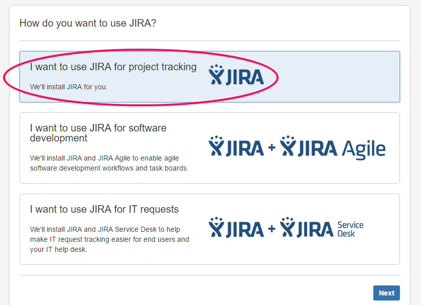

* Specify your JIRA License Key

  

* Setup Administrator account

  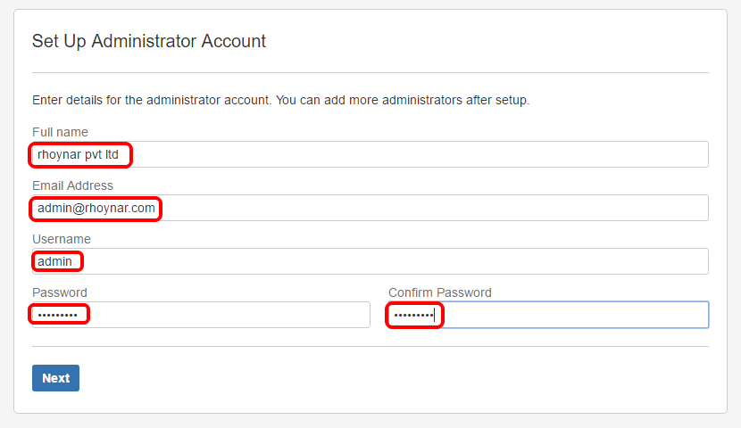

* Configure Email id, Avatar and finish installation with basic intro to JIRA. Once you're done with everything you can see JIRA dashboard.

  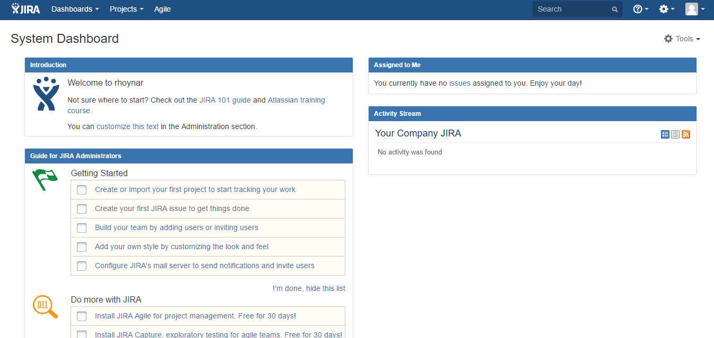

* Now let us add JIRA CLI Add-ons for interacting with JIRA using CLI, click gear icon on top right corner to add Add-ons.

  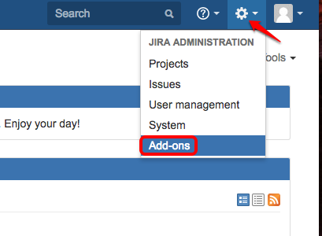

* From the list of available Add-ons choose `JIRA Command Line Interface (CLI)` which is Atlassian Verified, to install it.

  

### JIRA Functionality

* we have automated JIRA issues modification as per code-review actions.

* Currently we have added standard workflow transition for jira `"To Do – In Progress - Done"`

* In case if we need to modify the jobs for transition state. We need to modify puppet **jjb template** in puppet-master. For modifying jjb follow [instructions](#a1) given in the Jenkins Job.

---
## Jenkins master and slave

Puppet Module will install Jenkins on Agent2, visit the instance IP with port 8080 to configure Jenkins [*192.168.35.12:8080*](https://192.168.35.12:8080)

* Initiall password will be automatically generated in the following location */var/lib/jenkins/secrets/initialAdminPassword*

* Login to the instance and copy paste the password.

  

* Proceed with installing the basic required plugins for Jenkins.

* Manually Setup new administrator *username* and *password* for administrator account.

  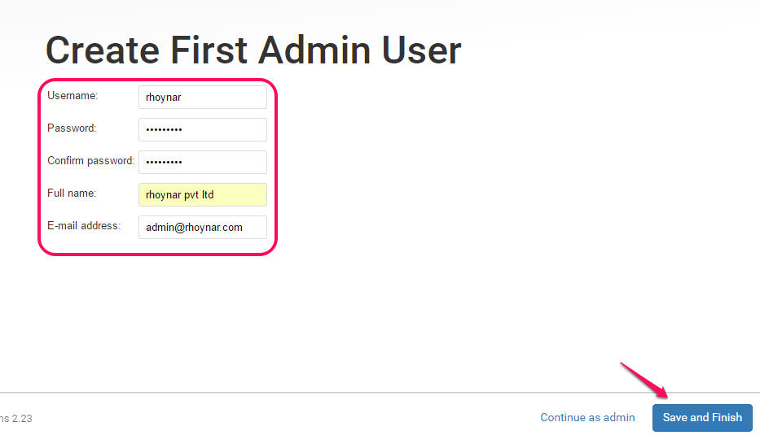

* Now Jenkins is ready.

  

* Let us make connection with Gearman for interaction. Configure Gearman server IP and Listening port to establish connection with Gearman.

  

* After successful connection to Gearman with Jenkins we could see the list of Jobs created automatically in Jenkins Dashboard.

  

### <a name="a1"></a>Jenkins Job Functionality


We have automated Jenkins jobs using puppet through zuul server. Currently we are have created 4 jobs, in case if we need to modify or add new jobs to it follow  the below instructions

Zuul creates Zenkins job according to the modules configuration.

Making changes to the modules will affect the build steps.

#### To edit/add/modify additional Job/Project in build steps

Edit the following file in Puppet-Master for making changes with respect to job or project.

* /etc/puppet/modules/zuul/templates/jjb.yaml.erb

* /etc/puppet/modules/zuul/manifests/params.pp

Finally add the modified entries in main site.pp

* /etc/puppet/manifests/site.pp

**Once all is done, then pull changes from puppet server to zuul server(agent 4) using “puppet agent -t” command.**

---

## Gerrit

Gerrit is a code review tool which will be installed in Agent3 by puppet module.

* Visit the Gerrit IP with port 8090 to configure Gerrit by registering or signing in.

  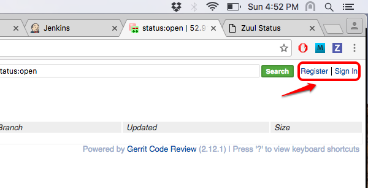

* Sign in to Gerrit with the existing account.

  

* After successful sign in we can edit settings.

  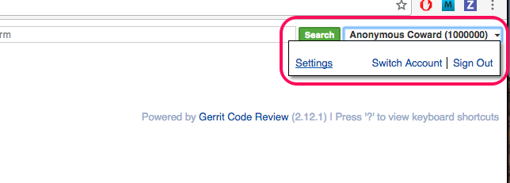

* Under `profile` select username to setup.

  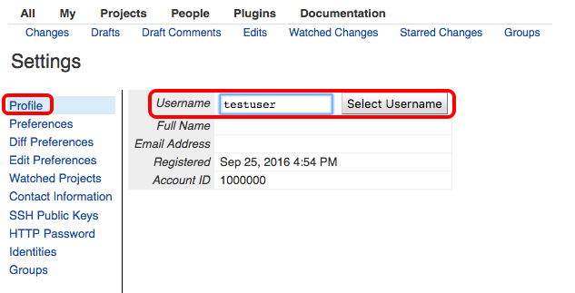

  and confirm the username by selecting `OK`.

  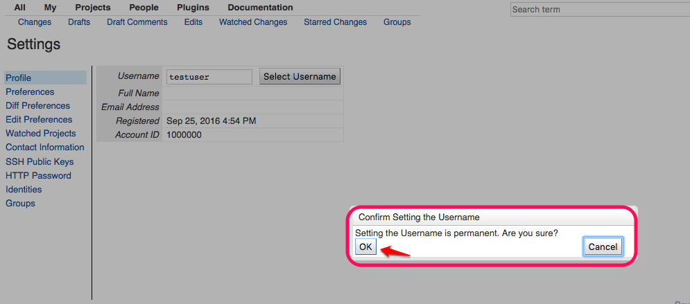

* Add a SSH public key to Gerrit under `SSH Public Keys`

  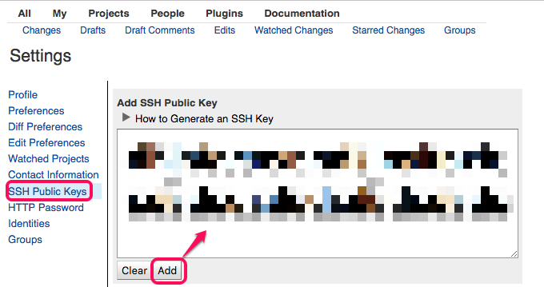

* Generate HTTP Password for the user that we created under `HTTP Password` settings

  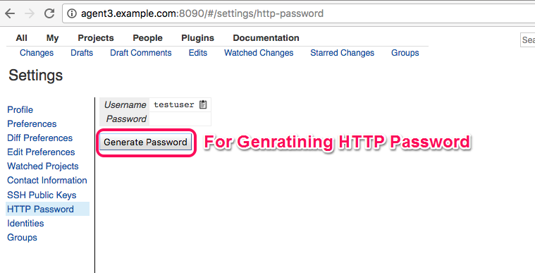

* Create a new project under `Projects` section.

  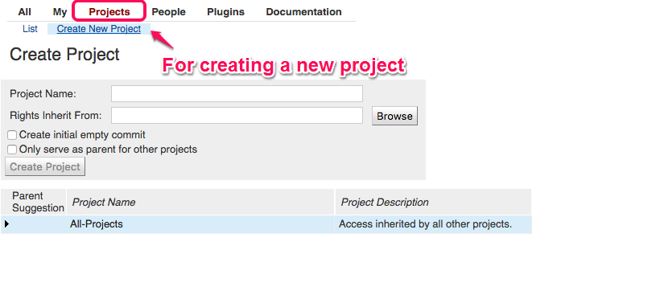

* Clone `test-project` from agent3 for testuser and choose `FALSE` for `Allow content merges`

  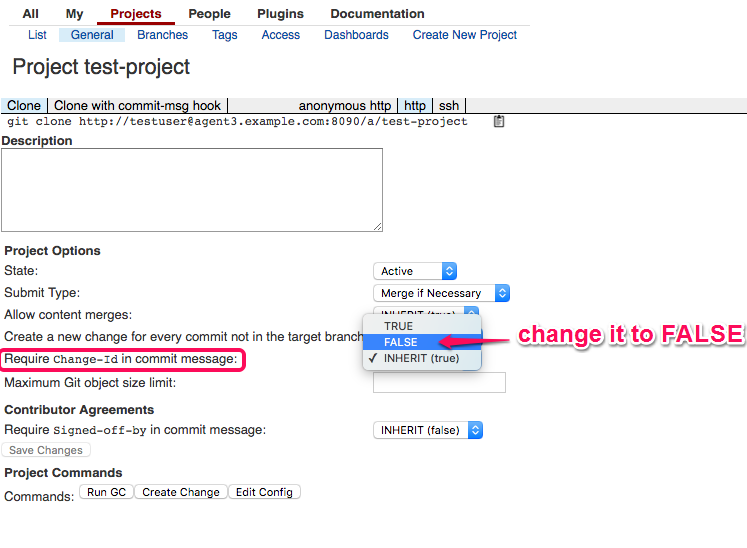

---

## Zuul

Puppet module will install Zuul in Agent4. Zuul is a pipeline oriented project gating and automation system.

After installation visit the IP for Zuul Dashboard.

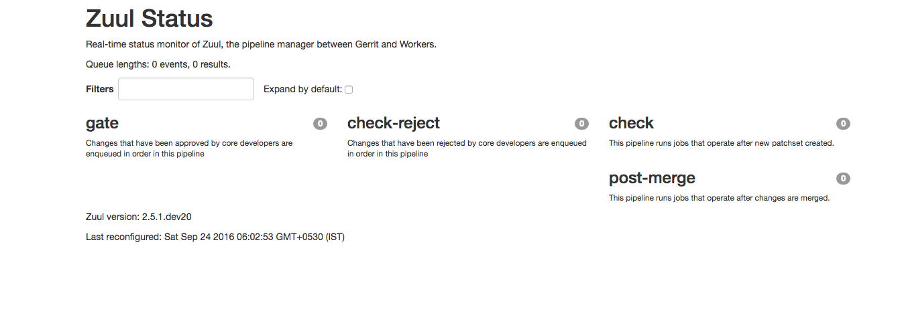

---

# SITE.PP

Let us dig deep in each resource of site.pp

## Agent1 - JIRA

In this resource part the *Jira class* for installing JIRA and *postgresql class* for db server is configured along with username and password.

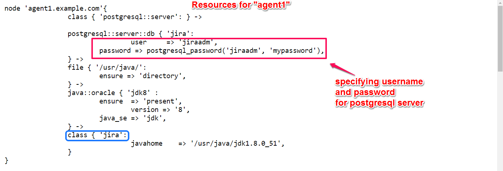

---

## Agent2 - Jenkins

In agent2 resource part Jenkins modules are included along with credentials of JIRA for integration as follows,


---

## Agent3 - Gerrit

Gerrit class is included in agent3 resource part with jenkins slave configuration for integration as shown below,


---

## Agent4 - Zuul

Resource part for agent4 includes Zuul with the following specifications for proper integration,

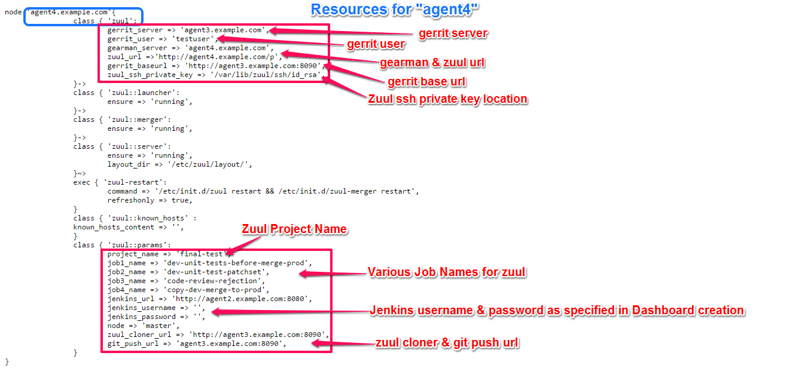

---

## Git-Review

We use `git-review` tool for submitting git branches to gerrit for review.

### Installation

We use `pip` to install `git-review`

```
pip install git-review
```

### Setup

By default, git-review will look for a remote named ‘gerrit’ for working with Gerrit. If the remote exists, git-review will submit the current branch to HEAD:refs/for/master at that remote.

If the Gerrit remote does not exist, git-review looks for a file called .gitreview at the root of the repository with information about the gerrit remote. Assuming that file is present, git-review should be able to automatically configure your repository the first time it is run.

The name of the Gerrit remote is configurable; see the configuration section below.

### .gitreview configuration file

Example .gitreview file (used to upload for git-review itself):

```
[gerrit]
host=review.openstack.org
port=29418
project=openstack-infra/git-review.git
defaultbranch=master
```

**Note:**

Required values: host, project

Optional values: port (default: 29418), defaultbranch (default: master), defaultremote (default: gerrit).

*For more detailed informaton visit [`openstack-docs`](http://docs.openstack.org/infra/git-review/)*

### Git Workflow


1.	Cloning Project:

  First we need to clone project to local directory to modify it.

  `e.g: git clone http://agent3.example.com:8090/Project-Name`

2.	Change Branch to Dev:

  After cloning project to local directory we need to change the branch to dev.

  `e.g: git checkout dev or git checkout -b dev`

3.	 Pull changes from dev:

  Once you changed to dev branch you need to pull recent changes for dev branch.

  `e.g: git pull origin dev`

4.	Modify your code:

  Then you can start with your work of modifying the code.

5.	Add changes to git:

  Once you done with all your changes you need to add changes to git.

  `e.g: git add file-name or git add`

6.	Commit your changes:

  Then commit your code, this time we need to take care, while committing code we need to follow the below given standard format

  git commit -m “JIRA_ISSUE_ISSUE-ID”

  `e.g: git commit -m  “JIRA_ISSUE_TEST-1”`

7.	Push your changes:

  Once you committed your changes push code for code-review, we can push code with 2 ways either git push or git-review

  `e.g: git push origin HEAD:refs/for/dev`

  git-review

---

## Post Installation Steps

* Once the setup is configured successfully we can stop the puppet master-slave process.

* It is *not mandatory* to stop the process.

* To stop puppet-master login to master machine and run the following command.

```
service puppetmaster stop
```

* Simillarly to stop puppet-agent login to each agent machine and run the following command.

```
service puppet stop
```
